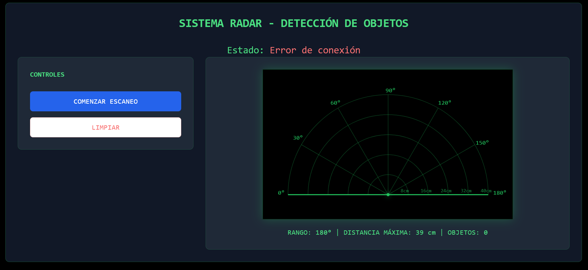

# Proyecto Final Lenguajes de Interfaz

Este proyecto consta de una aplicación principal desarrollada con Next.js y un servidor auxiliar en Node.js. El servidor auxiliar está diseñado para leer datos de un arrduino desde un puerto serial (específicamente COM5 a 9600 baudios) y, enviarlos a la aplicación Next.js, la cual muestra un radar como el siguiente:



## Requisitos Previos

Antes de comenzar, asegúrate de tener instalado lo siguiente:
- [Node.js](https://nodejs.org/) (se recomienda la versión 20.x)
- [npm](https://www.npmjs.com/) (generalmente viene con Node.js) o [yarn](https://yarnpkg.com/)

## Instalación

Sigue estos pasos para configurar el entorno de desarrollo:

1.  **Clonar el repositorio:**
    ```bash
    git clone https://github.com/DiCZDC/ProyectoFinalLenguajesDeInterfaz.git
    cd ProyectoFinalLenguajesDeInterfaz
    ```

2.  **Instalar dependencias de la aplicación Next.js:**
    Navega al directorio principal del proyecto Next.js (si es la raíz del repositorio, ya estás ahí).
    ```bash
    npm install
    # o si usas yarn
    # yarn install
    ```

3.  **Instalar dependencias del servidor auxiliar Node.js:**
    ```bash
    # Recuerda hacerlo desde la raiz del proyecto
    npm install
    ```
    *Nota: Si el servidor auxiliar no tiene su propio `package.json` y sus dependencias están incluidas en el `package.json` principal, este paso podría no ser necesario o sería parte del paso 2.*

## Configuración

### Servidor Auxiliar Node.js (Lector de Puerto Serial)

-   **Puerto Serial:** El servidor está configurado por defecto para escuchar en el puerto `COM5`.
-   **Baudios:** La velocidad de comunicación está configurada a `9600` baudios.

Si necesitas modificar esta configuración (por ejemplo, usar un puerto COM diferente o ajustar la velocidad de baudios), deberás localizar el archivo del servidor Node.js que maneja la conexión serial (comúnmente podría llamarse `server.js`, `serial_handler.js`, `index.js` dentro del directorio del servidor, etc.) y ajustar los parámetros correspondientes.

Por ejemplo, si se utiliza la librería `serialport` (una librería común para estas tareas en Node.js), la configuración podría verse así en tu código JavaScript:
```javascript
// Ejemplo de configuración en el código del servidor Node.js
const { SerialPort } = require('serialport');

const port = new SerialPort({
  path: 'COM5', // Cambia 'COM5' si es necesario
  baudRate: 9600, // Cambia 9600 si es necesario
});

// Manejo de eventos del puerto serial
port.on('open', () => {
  console.log('Puerto serial COM5 abierto a 9600 baudios');
});

port.on('data', data => {
  console.log('Datos recibidos:', data.toString());
  // Aquí procesas o reenvías los datos
});

port.on('error', err => {
  console.error('Error en el puerto serial:', err.message);
});
```
Asegúrate de que la librería `serialport` (o cualquier otra que uses) esté declarada en el `package.json` correspondiente y se instale correctamente.

## Ejecución del Proyecto

Debes ejecutar tanto la aplicación Next.js como el servidor auxiliar Node.js, preferiblemente en terminales separadas.

1.  **Iniciar el servidor auxiliar Node.js:**
    ```bash
    node server.js
    ```
    Este comando iniciará el servidor que lee del puerto serial. Verifica la consola para mensajes de estado (como "Puerto serial COM5 abierto...") o errores.

2.  **Iniciar la aplicación Next.js:**
    Navega al directorio raíz de la aplicación Next.js.
    ```bash
    npm run dev
    # o si usas yarn
    # yarn dev
    ```
    Esto iniciará el servidor de desarrollo de Next.js, usualmente en `http://localhost:3000`. Abre esta URL en tu navegador para ver la aplicación.

